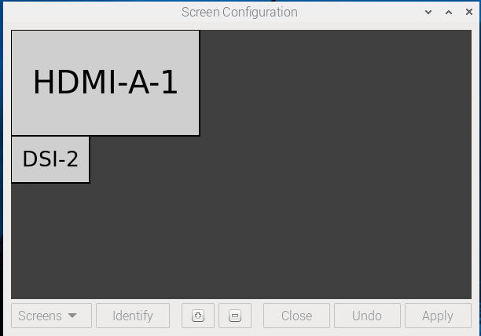
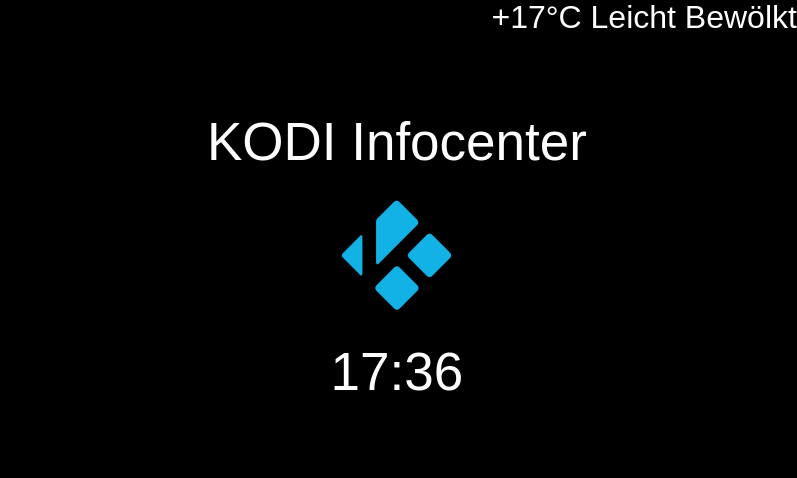
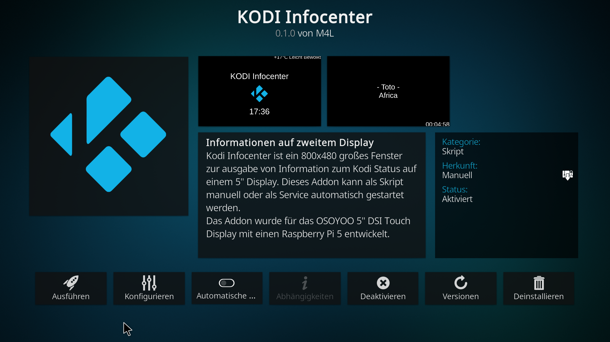
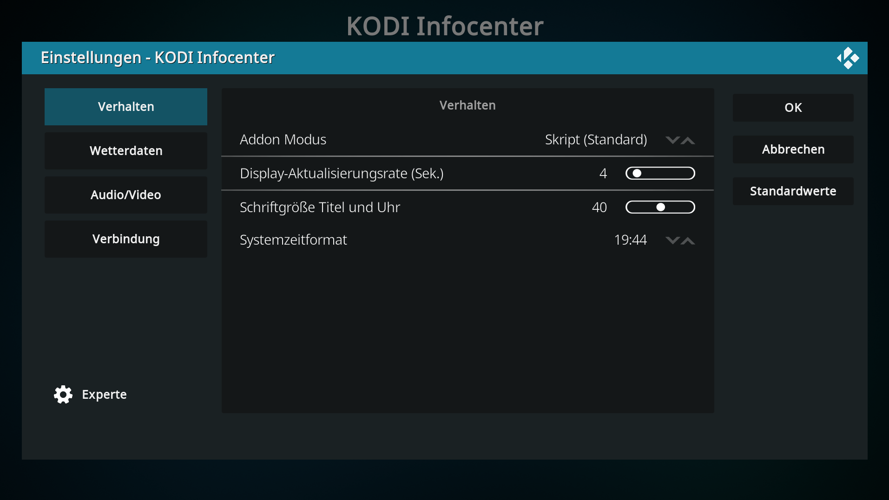
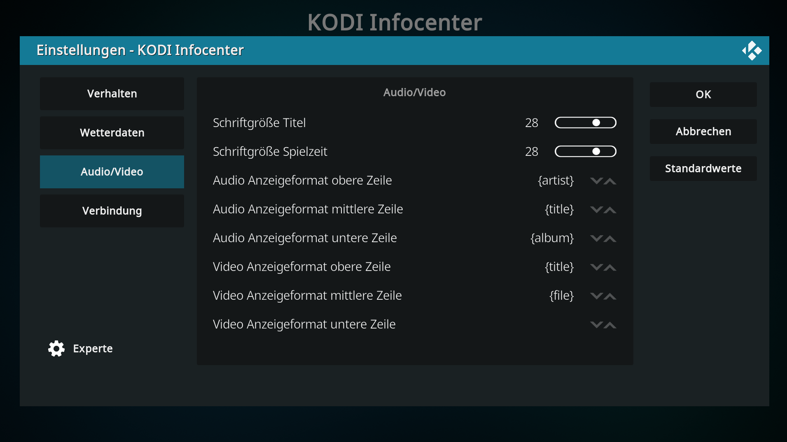

# Kodi Infocenter
This Kodi add-on was developed for the Raspberry PI UCB project. When the Kodi script is launched, an 800x480 window opens for output to a 5" display. Information about the Kodi status is displayed in this window.
The outputs can be set as usual with plugins.

The plugin has only been tested with the Raspberry Pi 5 and is still under development.

## Install:
Kodi Infocenter uses QT for the window
sudo apt-get update
sudo apt-get install python3-pyqt5

Under Services -> Control -> Allow remote control via HTTP, enable it and assign a user name and password.
After installing the plugin, enter the same port, user name, and password in the plugin settings.

## Known issues:
The window won't launch on the second monitor. The problem is apparently with Wayland, which prevents the move command from being executed. Simply drag the window to the 5" display (800x480, DSI) with the mouse.

Desktop setup (HDMI = Kodi Screen, DSI-2 = Kodi Infocenter Screen, 5" Display, 800x480)

Idle Window

Player Window

